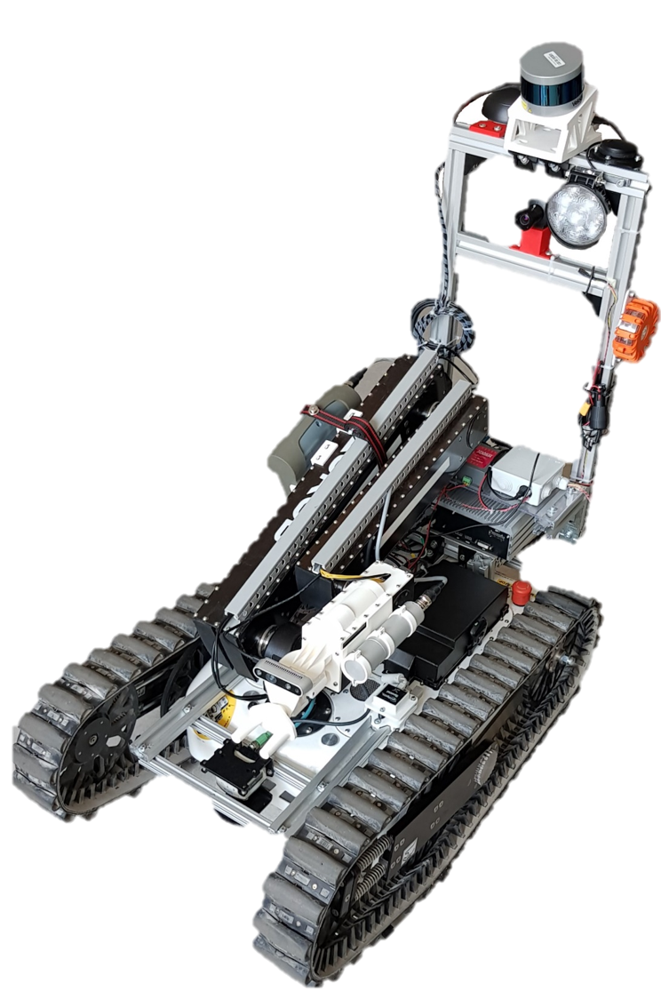

# UAS Technikum Vienna S&R Robot Simulation

This repository contains files necessary to simulate the S&R robot of the UAS Technikum Vienna.



For more about the S&R project see: [Design and Implementation of a Mobile Search and Rescue Robot](https://diglib.tugraz.at/download.php?id=5f6b0645e51ff&location=datacite)
```
@inProceedings{Novotny2020, 
	author= {{Novotny, Georg} and {Kubinger, Wilfried}}, 
	title= {Design and Implementation of a Mobile Search and Rescue Robot}, 
	year= {2020}, doi= {10.3217/978-3-85125-752-6-06}, 
	publisher= {Verlag der Technischen Universität Graz}}
```


There are 2 ways to build it:
1. Build from source:
    1. Install dependencies
    ```
    cd catkin_ws/src
    git clone https://github.com/tu-darmstadt-ros-pkg/gazebo_ros_control_select_joints.git
	git clone https://github.com/roboticsgroup/roboticsgroup_gazebo_plugins.git
    cd .. && catkin_make

    ```
    2. Copy the [files](./install/taurob_tracker_simulation) to your catkin_ws/src
    `cd catkin_ws && catkin_make`
2. Use Docker:
    1. Execute the [build.sh](./build.sh) script (set arguments in file if needed)
    `bash build.sh`
    2. Execute  th [run_docker.sh](run_docker.sh) script
    `bash run_docker.sh`
