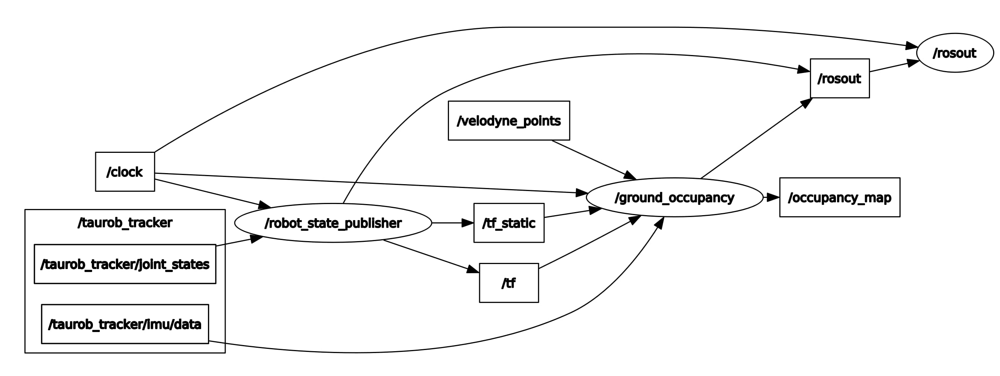

# Ground Occupancy Classification using 3D LiDAR data
In this project, the concept of an algorithm, which is used as a basis for outdoor path planning, is developed and implemented as a ROS-node.
The node performs cell vise classification of 3D LiDAR data and publishes a 2D local map of the environment.

## Functionality
1. Transform received Point Cloud from lidar frame into robot frame
2. Sort points into 2D Grid, along the robots X- and Y-axis
3. for each cell in the grid:
        - estimate an affine plane by performing a PCA on all the points contained in the cell
        - extract the normal vector of the estimated plane
        - calculate the angle of the planes slope
	    - depending on the anlge, classify cell as 
		    - non-occupied (0) 
		    - occupied (100)
		    - unknown (-1), if not enough points for evaluation are available
4. publish 2D local map of occupancy

## Start-up
Open a new terminal and run:
```
rosrun ground_occupancy ground_occupancy
```

for debugging, using *gdbgui*, launch the node via:

```
roslaunch ground_occupcany debug.launch
```

## Subscribed Topics
The node subscribes the following topics
- *"/velodyne_points"* to receive 3D LiDAR data
- *"/taurob_tracker/imu/data"* to retrieve the orientation of the robot

## Published Topics
The node publishe to the following topics
- *"occupancy_map"* providing a 2D local map of the robots environment

## ROS-Graph
A detailed visual description of the ROS nodes connections



## Configuration
Following parameters are available and implemented with a default value:

- *GRID_RES*:  0.4, the cell resolution of the 2D occupancy grid map (in meters)*
- *MAP_WIDTH*: 16, the width of the 2D occupancy gid map (in meters)*
- *MAP_HEIGHT*: 16, the height of the 2D occupancy gid map (in meters)*
- *MAX_ANGLE*: 35, maximum traversable angle of the UGV (in degrees)
- *FROM_FRAME*: "velodyne" , name of the frame the points are going to be transformed from
- *TO_FRAME*: "imu_link", name of the frame the points are going to be transformed to

*only used on Node start up